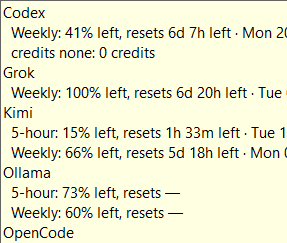
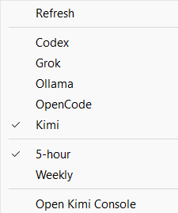

# AI Usage Bar

See the state of your AI subscriptions at a glance—without opening five
different dashboards.

AI Usage Bar is a Windows-first, local-only usage widget for hosted AI
services. It keeps each provider separate, shows the relevant usage windows and
reset state, and never sends your credentials to a project server.

<p align="center">
  
</p>

## What it looks like

The bar is deliberately small, but it has three useful levels of detail:

| Compact pill | Hover details | Right-click controls |
| --- | --- | --- |
|  |  |  |
| Click the pill to cycle providers. | See every provider and its available windows. | Choose a provider, switch windows, refresh, or open a provider page. |

These screenshots are from the Windows shell; usage values and reset countdowns
change as providers refresh.

The compact pill appends a short marker for the focused quota window: `5h` for
five-hour/session usage, `W` for weekly usage, and `M` for OpenCode monthly
usage (Kimi's optional total window is marked `T`).

Typical interactions:

- **Click** the pill to cycle the focused provider.
- **Hover** to see live, cached, stale, unavailable, and not-configured states.
- **Right-click** to choose a provider or quota window, refresh, copy details,
  show or hide providers and rows, open a provider's usage page, edit OpenCode
  reset anchors, or enable/disable running automatically when Windows starts.

## Supported providers

| Provider | What the bar reports | Important limitation |
| --- | --- | --- |
| Codex | CLI-reported five-hour and weekly usage windows and reset times | Uses the existing Codex CLI session. |
| Grok | SuperGrok weekly usage and reset time | Uses the Grok Build CLI session. |
| Kimi | Five-hour and weekly windows, plus an optional total/credits view | Requires `kimi login`; some plan fields may be absent upstream. |
| Ollama Pro | Hosted five-hour and weekly totals | Reset timestamps are not exposed by Ollama yet; the menu opens the usage page. |
| OpenCode Go | Account-authoritative five-hour, weekly, and monthly percentages plus reset times when the local Go key is available | Reads the existing OpenCode Go key and calls the provider usage endpoint; falls back to an explicitly inferred local estimate when no key is available. |

OpenCode Go uses nested quota gates: when Monthly is exhausted, the compact
bar is locked to Monthly; when Weekly is exhausted, it is locked to Weekly and
the 5-hour window cannot be selected until the outer limit resets.

The widget does not scrape dashboards, import browser cookies, or combine
unrelated provider limits into a misleading “total” percentage. See the
[provider matrix](docs/provider-matrix.md) for sources and known limitations.

## Example detail text

The exact numbers change as providers refresh, but the shape looks like this:

```text
Grok
  Weekly: 100% left · resets in 6 days 20 hours

Kimi
  5-hour: 15% left · resets in 1 hour 33 minutes
  Weekly: 66% left · resets in 5 days 18 hours

Ollama
  5-hour: 73% left · reset time unavailable
  Weekly: 60% left · reset time unavailable
```

## Quick start

### Download the Windows package

1. Download the [latest Windows x64 release](https://github.com/ferminquant/ai-usage-bar/releases/latest).
2. Verify the adjacent `.zip.sha256` file.
3. Extract the ZIP and run `install.ps1` for a per-user installation.
4. Start the bar from the Start menu or let the registered startup entry launch
   it with Windows.

The current public package is explicitly unsigned; the release notes and
manifest say so. The package and upgrade process are documented in
[Windows packaging](docs/packaging.md), including the
[manual verify-and-install steps](docs/packaging.md#verify-and-install-a-published-release).

### Configure providers

The provider panel is the preferred way to enable or disable hosted providers:
uncheck a provider to hide it and stop its refreshes, then turn on **Disabled**
to restore it later. Advanced users can still set `enabled` to `false` in
`%APPDATA%\AI Usage Bar\config.json`. Provider credentials remain in each
provider's own local CLI/session store.

### Build from source

```powershell
cargo build --release --locked --bin ai-usage-bar --bin ai-usage-bar-shell
```

For a portable package, run:

```powershell
pwsh -File packaging/package.ps1 -OutputDirectory .\dist
```

Run the full local checks with:

```powershell
cargo test --locked
cargo clippy --locked --all-targets -- -D warnings
python -m unittest discover --start-directory scripts --pattern "test_*.py"
```

## Product direction

The widget should answer one question quickly: “What is the state of each AI
service I can use right now?”

It should:

- show each provider independently;
- show the relevant limit window(s), remaining/used values, and reset time;
- distinguish live, cached, stale, unavailable, and not-applicable data;
- keep credentials on the machine and avoid sending them to a project server;
- support providers whose limits are quotas, credits, or spend rather than
  pretending all usage is one comparable percentage;
- provide a compact glance view plus a detailed provider view.

It should not:

- scrape or bypass provider controls;
- combine unrelated percentages into a false “total quota”;
- invent hosted usage data for an unsupported provider.

## Documentation

- [Product brief](docs/product-brief.md) — problem, users, goals, and
  non-goals.
- [Architecture](docs/architecture.md) — local daemon, adapters, cache, and
  desktop shell boundaries.
- [Snapshot contract](docs/snapshot-contract.md) — the provider-neutral
  usage snapshot model, state/value semantics, fixture requirements, and the
  unit/property/invariant test cases that adapters and the cache must
  satisfy.
- [Provider matrix](docs/provider-matrix.md) — what is known, what is
  uncertain, and the proposed evidence path for each provider.
- [Agile plan](docs/agile-plan.md) — increments, definition of ready/done,
  and the first backlog slices.
- [Configuration example](docs/config.example.json) — hosted-provider
  enablement settings; credentials remain in provider-owned local sessions.
- [Quality engineering](docs/quality-engineering.md) — measurable gates,
  evidence artifacts, and the “constraints around agent-generated code”
  approach.
- [Security boundaries](docs/security.md) — redaction, safe diagnostics,
  dependency/secret gates, and the allowlisted browser hand-off.
- [Contributing](CONTRIBUTING.md) — development setup, testing, and pull
  request expectations.
- [Security policy](SECURITY.md) — supported versions and private
  vulnerability reporting.
- [Quality baseline](docs/generated/quality-baseline-20260807.md) —
  the first executable coverage and mutation measurements.
- [Testing strategy](docs/testing-strategy.md) — unit, contract, invariant,
  integration, UI, packaging, security, and mutation-test plans.
- [Runner strategy](docs/runner-strategy.md) — CI runner isolation and the
  GitHub-hosted default.
- [Windows packaging](docs/packaging.md) — the portable package format,
  startup/upgrade/uninstall behavior, signing, and smoke test.
- [References](docs/references.md) — design inspiration, prior art, and
  primary provider documentation.

## Initial release scope

The initial release was deliberately small and established:

1. a Windows tray/taskbar shell with a compact pill and a detail panel;
2. a provider-neutral usage snapshot model;
3. one or more reliable hosted-provider adapters;
4. cached data with explicit freshness and error states;
5. fixture-driven tests and a quality gate before more providers are added.

The implemented adapters use provider-authorized sessions and documented or
observed CLI-backed usage surfaces. A browser/dashboard bridge remains an
option for future providers that expose no supported API, but it must stay
read-only and opt-in.

## Quality promise

The project follows the principle behind
[Robert Martin’s reference post](https://x.com/i/status/2080257779395154409):
agent-generated implementation is surrounded by strong, executable
constraints rather than trusted because it looks plausible. The planned
constraints include:

- deterministic unit and provider-contract tests;
- Gherkin-style acceptance scenarios for user-visible behavior;
- cross-layer invariants for snapshots, caching, freshness, and privacy;
- coverage with a ratcheting baseline;
- mutation testing for the normalization and policy core;
- lint, type, dependency, secret, packaging, and UI smoke checks;
- generated quality evidence attached to CI runs.

The first executable baseline now records the full-repository coverage,
enforced policy-core scope, bounded mutation score, and dated exclusions. The
thresholds and artifact format are defined in [Quality engineering](docs/quality-engineering.md),
and implementation work is tracked in the [GitHub issue backlog](https://github.com/ferminquant/ai-usage-bar/issues).

## Development principles

- Prefer a small adapter contract over provider-specific logic in the UI.
- Treat provider data as evidence with a source, timestamp, and confidence.
- Never log access tokens, cookies, or raw authenticated responses.
- Make offline and stale states first-class; do not silently display old data
  as current.
- Keep every change small enough to validate in one focused issue or pull
  request.

## License

AI Usage Bar is dual-licensed under either the MIT License or the Apache
License, Version 2.0, at your option. See [LICENSE-MIT](LICENSE-MIT) and
[LICENSE-APACHE](LICENSE-APACHE).
